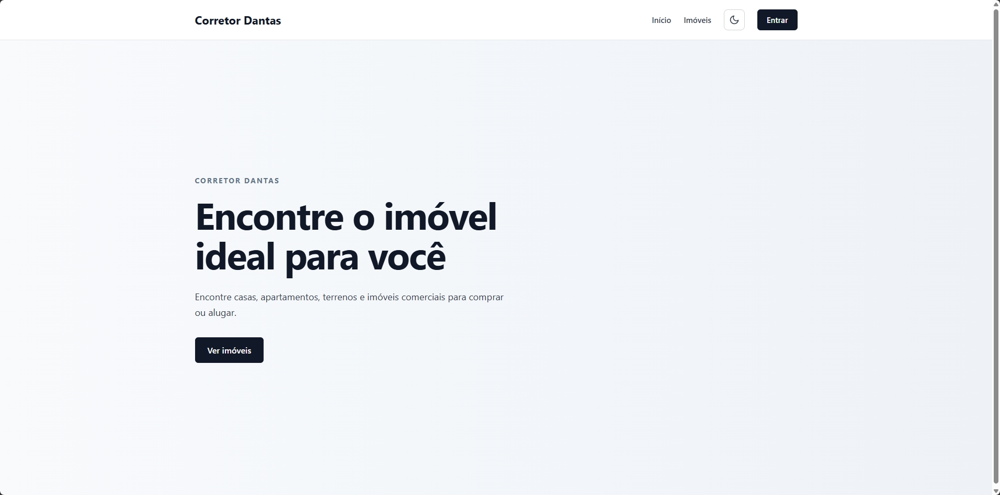
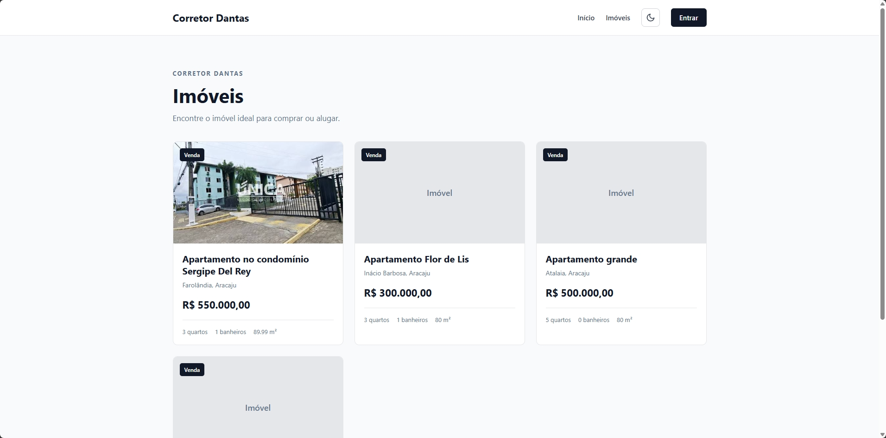
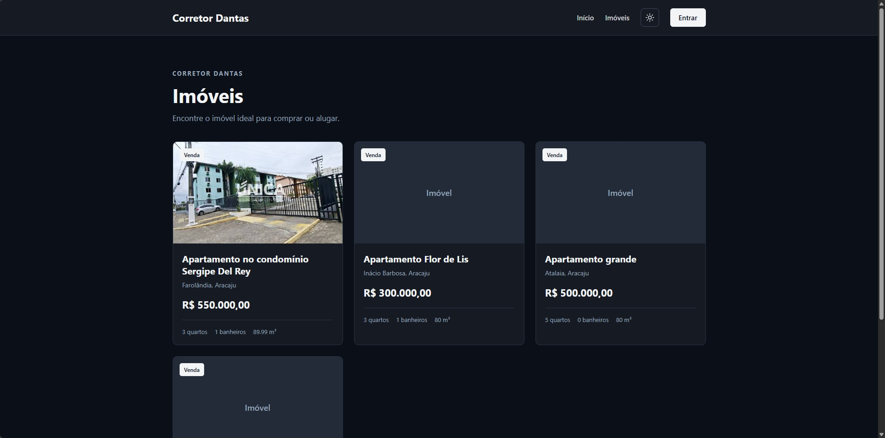
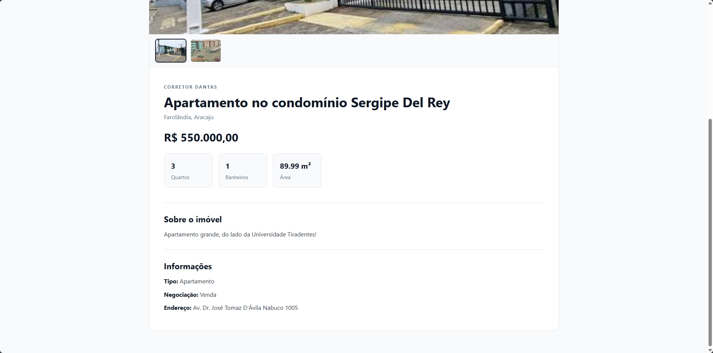
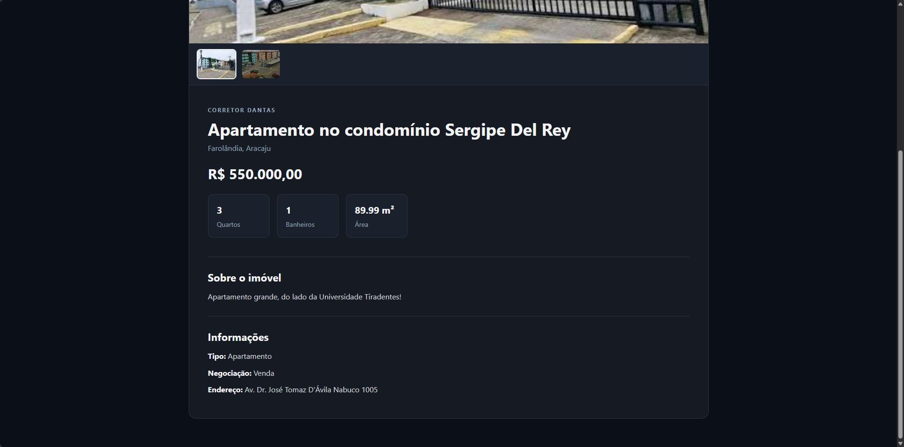
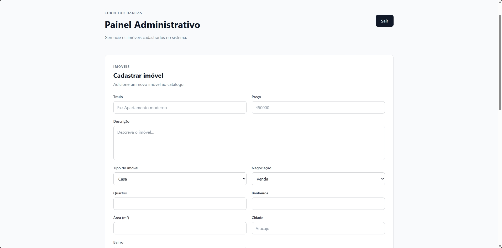
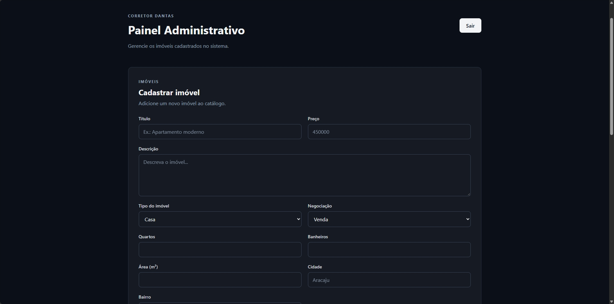
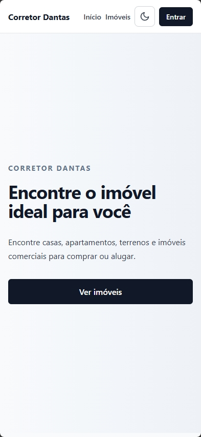

# 🏠 Corretor Dantas

Sistema web para **gerenciamento e divulgação de imóveis**, desenvolvido como projeto pessoal com foco em boas práticas, segurança e organização de uma aplicação full-stack.

O visitante navega pelo catálogo, vê as fotos e os detalhes de cada imóvel. O corretor acessa um painel administrativo protegido para cadastrar, editar, inativar imóveis e gerenciar as imagens.


---

## 📸 Telas

> Os prints ficam em [`docs/screenshots`](docs/screenshots).

### Página inicial

| Tema claro | Tema escuro |
|---|---|
|  |  |

### Catálogo de imóveis

| Tema claro | Tema escuro |
|---|---|
|  |  |

### Detalhes do imóvel com galeria

| Tema claro | Tema escuro |
|---|---|
|  |  |

### Painel administrativo

| Tema claro | Tema escuro |
|---|---|
|  |  |

### Versão mobile

| Tema claro | Tema escuro |
|---|---|
|  |  |

---

## ✨ Funcionalidades

**Para visitantes**

- Catálogo de imóveis com foto de capa, preço, localização e características
- Página de detalhes com galeria de imagens e miniaturas
- Modo claro e escuro, com preferência salva e respeito ao tema do sistema
- Layout responsivo (desktop, tablet e celular)

**Para o administrador**

- Login com autenticação JWT e controle de acesso por perfil (`ADMIN`)
- Cadastro, edição e inativação de imóveis
- Upload de até **10 imagens por imóvel** (JPG, PNG ou WebP, até 5 MB cada), com escolha da imagem de capa e remoção individual
- Mensagens de erro claras: validação dos campos, sessão expirada, falta de permissão e falha de conexão
- Redirecionamento automático para o login quando a sessão expira

**API**

- Listagem paginada com filtros por cidade, bairro, tipo, tipo de negociação e faixa de preço
- Respostas de erro padronizadas em JSON
- Validação do conteúdo real dos arquivos enviados (não confia só na extensão)
- Inativação lógica: imóveis inativos deixam de aparecer na listagem pública

---

## 🛠️ Tecnologias

### Back-end

- Java 21
- Spring Boot
- Spring Security com OAuth2 Resource Server (JWT assinado com HS256)
- Spring Data JPA / Hibernate e JPA Specifications (filtros dinâmicos)
- PostgreSQL
- BCrypt para senhas
- Bean Validation
- Lombok
- Maven

### Front-end

- React 19
- TypeScript
- Vite
- React Router
- Axios
- CSS puro com variáveis (temas claro e escuro)

---

## 🏗️ Estrutura do projeto

```
Corretor-Dantas/
│
├── corretor-dantas-api/                 # API REST - Spring Boot
│   ├── src/main/java/Corretor/Dantas/API/
│   │   ├── auth/                        # Login e geração do JWT
│   │   ├── config/                      # Segurança, CORS, arquivos estáticos, admin inicial
│   │   ├── controller/                  # Endpoints REST
│   │   ├── dto/                         # Objetos de entrada e saída
│   │   ├── entity/                      # Entidades JPA
│   │   ├── exception/                   # Exceções e tratamento global de erros
│   │   ├── repository/                  # Repositórios Spring Data
│   │   ├── service/                     # Regras de negócio e armazenamento de arquivos
│   │   └── specification/               # Filtros dinâmicos de imóveis
│   ├── src/main/resources/
│   └── pom.xml
│
├── corretor-dantas-web/                 # Interface - React + Vite
│   ├── src/
│   │   ├── components/                  # Navbar, PropertyCard, ImageGallery, ThemeToggle...
│   │   ├── hooks/                       # useTheme
│   │   ├── pages/                       # Home, Properties, PropertyDetails, Login, Admin
│   │   ├── routes/                      # Rotas e rota protegida
│   │   ├── services/                    # Chamadas à API (Axios)
│   │   ├── types/                       # Tipos TypeScript
│   │   └── utils/                       # Autenticação, erros e imagens
│   └── package.json
│
├── docs/
│   └── screenshots/                     # Prints usados neste README
│
└── README.md
```

---

## 🚀 Como executar

### Pré-requisitos

- [Java 21](https://adoptium.net/)
- [Node.js 18+](https://nodejs.org/)
- [PostgreSQL](https://www.postgresql.org/)
- Git

### 1. Clonar o repositório

```bash
git clone https://github.com/gabrielsouzaad/Corretor-Dantas.git
cd Corretor-Dantas
```

### 2. Criar o banco de dados

```sql
CREATE DATABASE corretor_dantas;
```

As tabelas são criadas automaticamente na primeira execução (`spring.jpa.hibernate.ddl-auto=update`). O banco é esperado em `localhost:5432`; para mudar, edite `spring.datasource.url` em `application.properties`.

### 3. Configurar as variáveis de ambiente

| Variável | Obrigatória | Descrição |
|---|---|---|
| `DB_USERNAME` | Sim | Usuário do PostgreSQL |
| `DB_PASSWORD` | Sim | Senha do PostgreSQL |
| `JWT_SECRET` | Sim | Chave de assinatura do token, com **no mínimo 32 caracteres** |
| `ADMIN_EMAIL` | Não | E-mail do administrador criado (ou promovido) ao iniciar |
| `ADMIN_PASSWORD` | Não | Senha do administrador inicial (mínimo de 8 caracteres) |
| `UPLOAD_DIR` | Não | Pasta onde as imagens são salvas (padrão: `uploads`) |

> ⚠️ **Nunca versione senhas ou chaves.** Configure estes valores apenas no seu ambiente.

Exemplo no PowerShell:

```powershell
$env:DB_USERNAME="postgres"
$env:DB_PASSWORD="sua_senha"
$env:JWT_SECRET="troque-por-uma-chave-longa-e-aleatoria-com-32-ou-mais-caracteres"
$env:ADMIN_EMAIL="admin@exemplo.com"
$env:ADMIN_PASSWORD="SenhaForte123"
```

Exemplo no Linux/macOS:

```bash
export DB_USERNAME=postgres
export DB_PASSWORD=sua_senha
export JWT_SECRET=troque-por-uma-chave-longa-e-aleatoria-com-32-ou-mais-caracteres
export ADMIN_EMAIL=admin@exemplo.com
export ADMIN_PASSWORD=SenhaForte123
```

No IntelliJ, as variáveis podem ser definidas em **Run → Edit Configurations → Environment variables**, separadas por `;`.

### 4. Iniciar o back-end

```bash
cd corretor-dantas-api
./mvnw spring-boot:run        # Windows: .\mvnw.cmd spring-boot:run
```

A API sobe em `http://localhost:8080`. Ao iniciar, se `ADMIN_EMAIL` e `ADMIN_PASSWORD` estiverem definidos, o administrador é criado, ou o usuário com esse e-mail é promovido a `ADMIN`.

Para promover manualmente uma conta já existente:

```sql
UPDATE users SET role = 'ADMIN' WHERE email = 'seu-email@exemplo.com';
```

> Depois de mudar o perfil de um usuário, entre novamente: o papel vai dentro do token.

### 5. Iniciar o front-end

```bash
cd corretor-dantas-web
npm install
npm run dev
```

O app abre em `http://localhost:5173`.

Por padrão o front usa `http://localhost:8080` como endereço da API. Para mudar, crie um arquivo `.env` em `corretor-dantas-web`:

```
VITE_API_URL=http://localhost:8080
```

> O CORS da API aceita requisições de `http://localhost:5173`. Se usar outra origem, ajuste `CorsConfig.java`.

### 6. Acessar

- Site: http://localhost:5173
- Login: http://localhost:5173/login
- Painel administrativo: http://localhost:5173/admin (somente `ADMIN`)

---

## 🔌 Endpoints da API

| Método | Rota | Acesso | Descrição |
|---|---|---|---|
| `POST` | `/auth/login` | Público | Autentica e retorna o token JWT |
| `POST` | `/users` | Público | Cadastra um usuário comum |
| `GET` | `/users/me` | Autenticado | Dados do usuário logado |
| `GET` | `/properties` | Público | Lista imóveis com filtros e paginação |
| `GET` | `/properties/{id}` | Público | Detalhes de um imóvel |
| `POST` | `/properties` | `ADMIN` | Cadastra um imóvel |
| `PUT` | `/properties/{id}` | `ADMIN` | Atualiza um imóvel |
| `DELETE` | `/properties/{id}` | `ADMIN` | Inativa um imóvel (exclusão lógica) |
| `POST` | `/properties/{id}/images` | `ADMIN` | Envia imagens (`multipart/form-data`, campo `files`) |
| `PUT` | `/properties/{id}/images/{imageId}/cover` | `ADMIN` | Define a imagem de capa |
| `DELETE` | `/properties/{id}/images/{imageId}` | `ADMIN` | Remove uma imagem |
| `GET` | `/uploads/**` | Público | Serve os arquivos de imagem |

### Filtros de `GET /properties`

| Parâmetro | Exemplo | Descrição |
|---|---|---|
| `city` | `Aracaju` | Cidade |
| `neighborhood` | `Farolândia` | Bairro |
| `type` | `APARTMENT` | `HOUSE`, `APARTMENT`, `LAND` ou `COMMERCIAL` |
| `transactionType` | `SALE` | `SALE` (venda) ou `RENT` (aluguel) |
| `minPrice` / `maxPrice` | `200000` / `600000` | Faixa de preço |
| `page` / `size` | `0` / `10` | Paginação (`size` máximo: 50) |
| `sort` | `price,asc` | Ordenação (padrão: `createdAt,desc`) |

Exemplo:

```
GET /properties?city=Aracaju&type=APARTMENT&maxPrice=600000&page=0&size=10
```

### Exemplo de resposta (`GET /properties/{id}`)

```json
{
  "id": 1,
  "title": "Apartamento no condomínio Sergipe Del Rey",
  "description": "Apartamento amplo e bem localizado.",
  "price": 550000.00,
  "type": "APARTMENT",
  "transactionType": "SALE",
  "bedrooms": 3,
  "bathrooms": 1,
  "area": 89.99,
  "city": "Aracaju",
  "neighborhood": "Farolândia",
  "address": "Rua Exemplo, 123",
  "status": "AVAILABLE",
  "createdAt": "2026-10-01T10:30:00",
  "updatedAt": "2026-10-01T10:30:00",
  "images": [
    { "id": 1, "url": "/uploads/3f6c1b8e.jpg", "cover": true }
  ]
}
```

### Formato padrão de erro

```json
{
  "status": 400,
  "message": "Dados inválidos",
  "timestamp": "2026-10-08T18:00:00",
  "errors": ["price: Preço deve ser maior que zero"]
}
```

---

## 🔐 Segurança

- Senhas armazenadas com **BCrypt**
- Autenticação **stateless** com JWT (HS256) e expiração configurável (`jwt.expiration`)
- Rotas de escrita de imóveis e imagens restritas ao perfil `ADMIN`
- Tokens inválidos ou expirados não afetam as rotas públicas
- Respostas `401` e `403` padronizadas em JSON
- Upload validado pelo conteúdo real do arquivo, com nome gerado aleatoriamente (UUID), limite de tamanho e de quantidade
- No front, a rota `/admin` verifica expiração e perfil do token, e a sessão é encerrada automaticamente em caso de `401`

> A verificação feita no front serve apenas à experiência de uso. A autorização real é sempre feita pela API.

---

## 🗺️ Roadmap

- [x] Cadastro e autenticação de usuários
- [x] CRUD de imóveis com inativação lógica
- [x] Filtros e paginação na API
- [x] Upload e galeria de imagens
- [x] Modo escuro e layout responsivo
- [x] Tratamento de erros padronizado
- [ ] Filtros e paginação na interface
- [ ] Contato direto com o corretor (WhatsApp)
- [ ] Reordenação de imagens
- [ ] Testes automatizados
- [ ] Deploy


---

## 👤 Autor

Desenvolvido por **[@gabrielsouzaad](https://github.com/gabrielsouzaad)**.